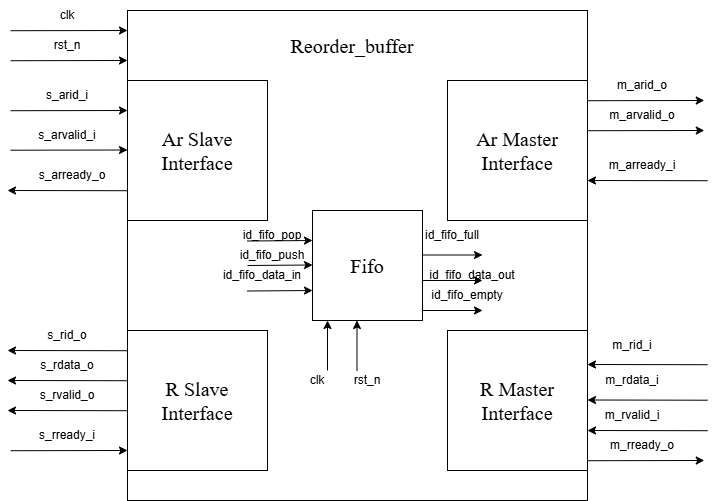

# Потоковый реордер буфер

## Описание работы основного модуля 

На вход подаются сигналы *s_arid_i*, *s_arvalid_i* при активном сигнале*s_arready_o*. *s_arready_o* становится поднимается если fifo не заполнено. Глубина фифо задаётся параметром *ID_DEPTH*, то есть в зависимости от желаемого количество id (максимум 16). Сигнал *s_arid_i* напрямую передаётся в *m_arid_o*, *s_arvalid_i* подключается в *m_arvalid_o*, но будет активным, только если fifo не заполнено полностью. 

Далее в тестбенче id перемешиваются и передаются на интерфейс R master через каналы *m_rvalid_i*, *m_rid_i*, *m_rdata_i*, *m_rready_o* всегда активный. Теперь id и data записываюстя в регистр в виде двумерного массива  `*logic [DATA_WIDTH-1:0] id_data    [ID_DEPTH - 1:0]*`. Data распределяется в регистре в зависимости от id, так же есть сигналы valid для каждой порции данных и id. 

Из fifo выходит сигнал *id_fifo_data_out*. При записи в fifo сдвигался только укзатель write_ptr, а read_ptr указывает на первый зашедший id, поэтому мы можем считывать регистр `*logic [DATA_WIDTH-1:0] id_data  [ID_DEPTH - 1:0]*` по *id_fifo_data_out* и получать на выход *s_rdata_o* и *s_rid_o* data и id в правильном порядке.

## Модуль Fifo 
* FIFO реализована как кольцевой буфер (fifo_q), в котором поддерживаются два указателя:

    *write_pointer_q* — указывает на позицию для следующей записи

    *read_pointer_q* — указывает на текущую позицию чтения

* Проверка состояний:

    *empty_o* устанавливается, когда указатели записи и чтения равны — очередь пуста.

    *full_o* устанавливается, когда младшие биты указателей равны, но старшие (переполнение) различаются — очередь полна.

* Запись (push)

    Если *push_i* активен и очередь не полна:

    Входные данные *data_i* записываются по адресу *write_pointer_q*. Указатель записи увеличивается. Буфер *fifo_q* обновляется (переписывается из временного *fifo*).

* Чтение (pop)

    Если *pop_i* активен и очередь не пуста:

    Указатель чтения увеличивается. Данные *data_o* всегда содержат текущее значение по адресу *read_pointer_q*.

## Диаграмма устройства

